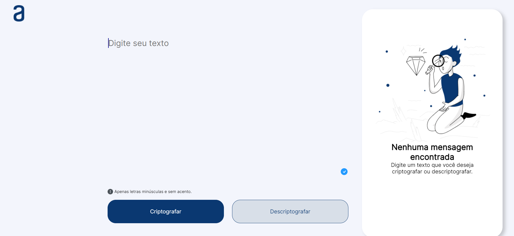

# Challenge Criptografia
️
## O que é o Challenge Criptografia?

O Challenge Criptografia é um projeto empolgante proposto pela Oracle Next Education e Alura que te convida a desvendar os segredos da criptografia e descriptografia de um modo divertido e interativo! Através da criação de um sistema que codifica e decodifica mensagens utilizando um método especial baseado em vogais.

️## 🔨 Ferramentas utilizadas:

* **Visual** Studio Code: Um editor de código leve e poderoso para facilitar o desenvolvimento do projeto.

* **GitHub**: Uma plataforma de controle de versão para armazenar, organizar e compartilhar o código do projeto com segurança.

* **HTML5**: A linguagem base para a estrutura da página web, definindo o conteúdo e a organização dos elementos.

* **CSS3**: A linguagem para estilizar a aparência da página web, controlando cores, fontes, layout e outros aspectos visuais.

* **JavaScript**: A linguagem de programação que dá vida à interatividade do sistema, permitindo a criptografia, descriptografia e manipulação do texto.

Para saber mais sobre mim e minhas habilidades, acesse meu perfil no LinkedIn:
 www.linkedin.com/in/luiz-fabiano-91542026b